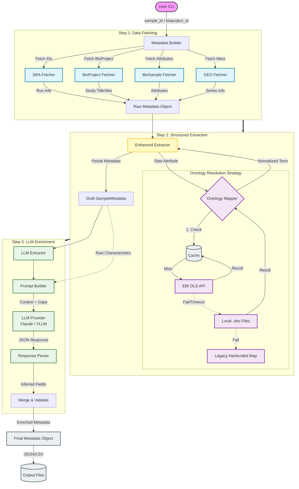

# Omics Extractor Workflow

```mermaid
graph TD
    %% Styles
    classDef input fill:#f9f,stroke:#333,stroke-width:2px;
    classDef fetcher fill:#e1f5fe,stroke:#0277bd,stroke-width:2px;
    classDef process fill:#fff9c4,stroke:#fbc02d,stroke-width:2px;
    classDef ai fill:#e8f5e9,stroke:#2e7d32,stroke-width:2px;
    classDef onto fill:#f3e5f5,stroke:#7b1fa2,stroke-width:2px;
    classDef storage fill:#eceff1,stroke:#455a64,stroke-width:2px;

    User([User CLI]) -->|sample_id / bioproject_id| Builder[Metadata Builder]
    class User input;

    subgraph Data_Acquisition [Step 1: Data Fetching]
        direction TB
        Builder -->|Fetch IDs| SRA[SRA Fetcher]
        Builder -->|Fetch BioProject| BioProj[BioProject Fetcher]
        Builder -->|Fetch Attributes| BioSample[BioSample Fetcher]
        Builder -->|Fetch Meta| GEO[GEO Fetcher]
        
        SRA -->|Run Info| Raw[Raw Metadata Object]
        BioProj -->|Study Title/Abs| Raw
        BioSample -->|Attributes| Raw
        GEO -->|Series Info| Raw
    end
    class SRA,BioProj,BioSample,GEO fetcher;

    subgraph Structured_Processing [Step 2: Structured Extraction]
        Raw --> EnhancedExt[Enhanced Extractor]
        
        EnhancedExt -->|Raw Attribute| OntoMapper{Ontology Mapper}
        
        subgraph Ontology_Lookup [Ontology Resolution Strategy]
            OntoMapper -->|1. Check| Cache[(Cache)]
            Cache -->|Miss| OLS_API[EBI OLS API]
            OLS_API -.->|Fail/Timeout| LocalFile[Local .obo Files]
            LocalFile -.->|Fail| Legacy[Legacy Hardcoded Map]
            
            OLS_API -->|Result| Cache
            LocalFile -->|Result| OntoMapper
        end
        
        OntoMapper -->|Normalized Term| EnhancedExt
        EnhancedExt -->|Partial Metadata| DraftMeta[Draft SampleMetadata]
    end
    class EnhancedExt process;
    class OntoMapper,OLS_API,LocalFile,Legacy onto;
    class Cache storage;

    subgraph AI_Enrichment [Step 3: LLM Enrichment]
        DraftMeta --> LLMExt[LLM Extractor]
        DraftMeta -.->|Raw Characteristics| PromptBuilder
        
        LLMExt --> PromptBuilder[Prompt Builder]
        PromptBuilder -->|Context + Gaps| LLM[LLM Provider<br/>Claude / VLLM]
        LLM -->|JSON Response| Parser[Response Parser]
        Parser -->|Inferred Fields| Merge[Merge & Validate]
    end
    class LLMExt,PromptBuilder,LLM,Parser ai;

    Merge -->|Enriched Metadata| Final[Final Metadata Object]
    Final -->|JSON/CSV| Output[(Output Files)]
    class Final,Output storage;

    %% Dependencies
    Data_Acquisition ==> Structured_Processing
    Structured_Processing ==> AI_Enrichment
```
